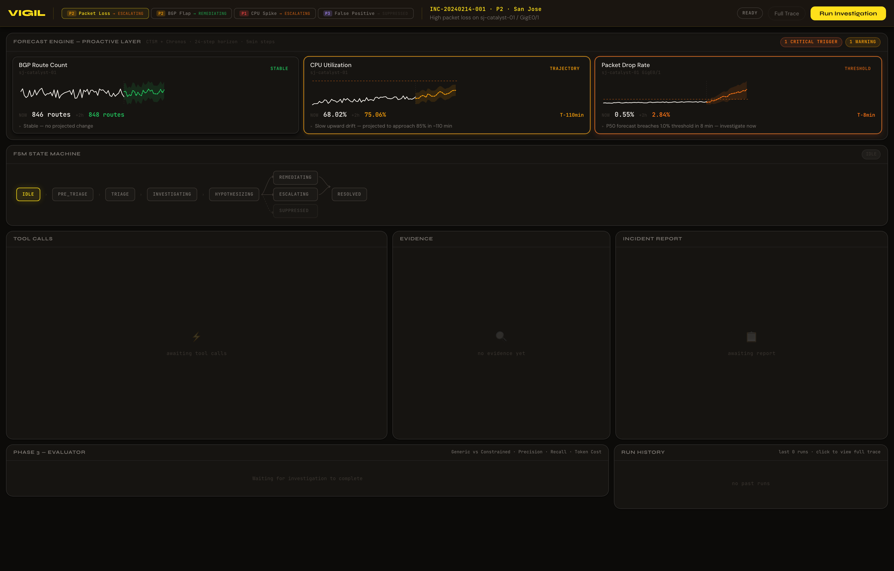
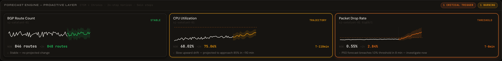
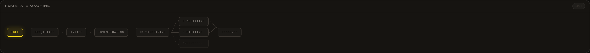
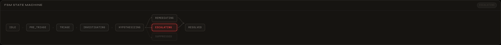
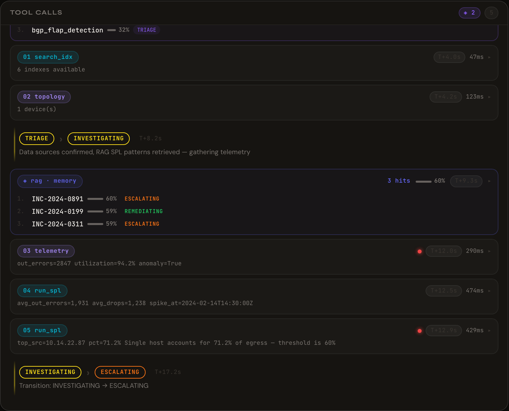
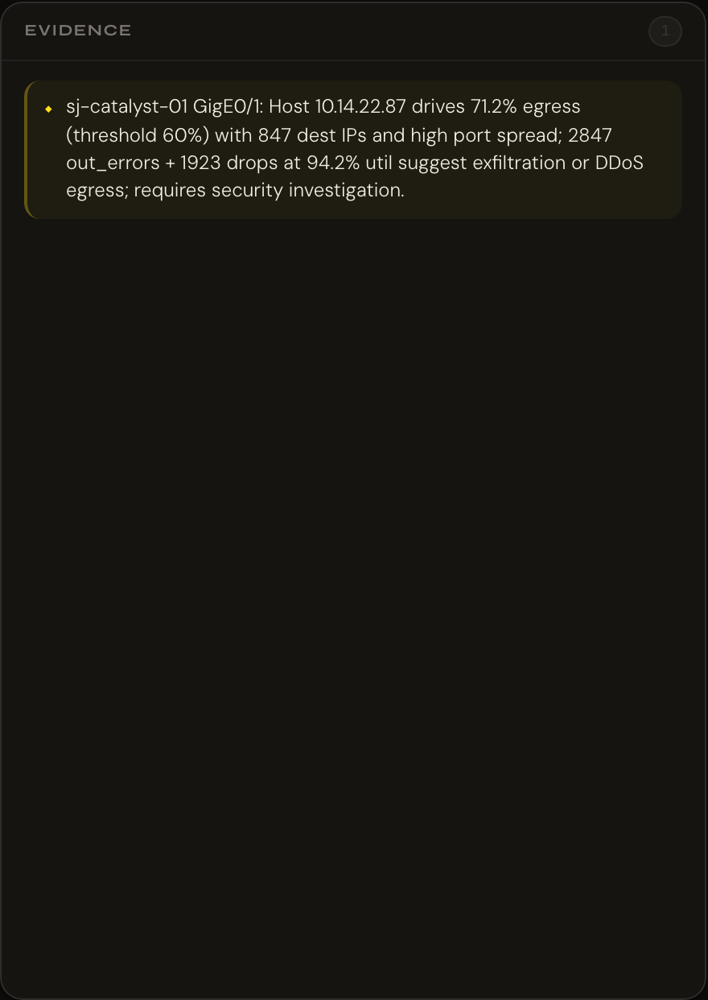
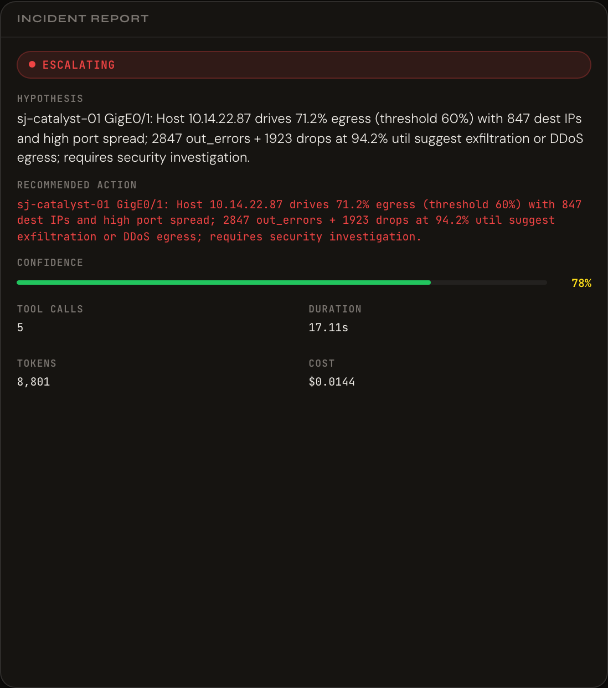
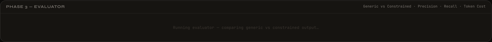
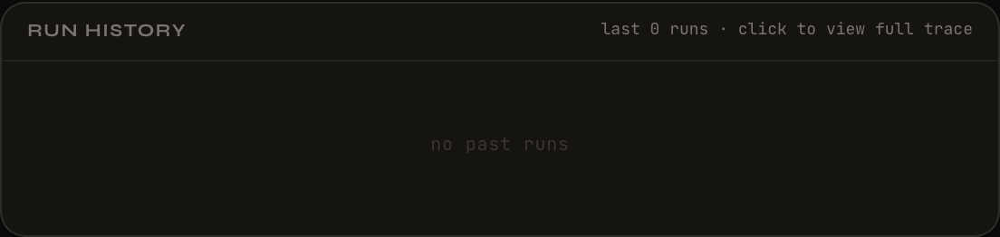
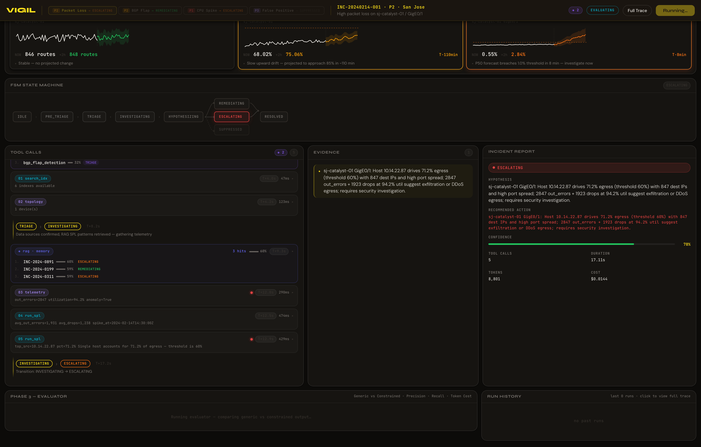

# Vigil Workflow — Visual Walkthrough

A section-by-section tour of the Vigil war-room dashboard, captured from the running local application. Each screenshot below shows a real UI region with real data — nothing is mocked in this walkthrough.

**How to read this doc:** each section covers one card or region of the UI, top-to-bottom in the order it renders on screen. For each region you get (a) the screenshot, (b) what it shows, and (c) what the underlying system is doing when it draws that view.

**Live demo:** [vigil-5vo3-14jb5xbig-nama7vijay-6218s-projects.vercel.app](https://vigil-5vo3-14jb5xbig-nama7vijay-6218s-projects.vercel.app) *(UI-only — for a full run with populated Tool Calls, Evidence, and Incident Report you'll need the local backend running; see [`../docs/deployment.md`](../docs/deployment.md#running-locally-full-stack).)*

---

## 0. Overview — Idle State



The full war-room dashboard before an investigation is triggered. Every card is in its "ready" state — forecast sparklines are drawn from pre-computed fixtures, the FSM sits at `IDLE`, and the Tool Calls / Evidence / Incident Report cards show empty-state placeholders. This is the view someone lands on when they first open Vigil.

**What's rendered here without a backend call:**
- Forecast Engine sparklines (fixture-backed — see [`ui/src/data/forecasts.ts`](../ui/src/data/forecasts.ts))
- FSM diagram in its resting layout
- Scenario tabs with pre-labeled outcomes (ESCALATING / REMEDIATING / SUPPRESSED)
- Run History (empty on first load, populated from `localStorage` on return visits)

---

## 1. Header — Scenario Selection + Action Bar


The header is the operator's control strip. Four elements matter:

| Element | Purpose |
|---|---|
| **`VIGIL` wordmark** | Product identity — Cavendish Yellow accent on obsidian black |
| **Scenario tabs** | Four canonical incidents — Packet Loss (ESCALATING), BGP Flap (REMEDIATING), CPU Spike (ESCALATING), False Positive (SUPPRESSED). Each tab has a severity pill (P1/P2/P3) and shows its expected FSM outcome. Clicking a tab loads that scenario's context; running an investigation shows whether Vigil reaches the labeled terminal state. |
| **Incident context** | Middle strip shows the incident ID (`INC-20240214-01`), severity (`P2`), site (`San Jose`), and a one-line title. Comes from `phase2_agent/scenarios/*.json`. |
| **Action buttons** | `Full Trace` opens the archived-run detail overlay. `Run Investigation` is the primary CTA — kicks off the FSM commander over SSE. |

The `READY` status pill on the far right cycles through `Investigating → Evaluating → Complete` (or `Error`) as a run progresses.

---

## 2. Forecast Engine — Proactive Trigger Layer



Vigil's Phase 4 pre-alert layer. Three time-series sparklines run continuously against Cisco Time Series Model (CTSM) + Chronos-T5-Small forecasts. Each panel shows historical values + a P10–P90 confidence band + the forecast median. The corner label declares which of four trigger types is firing:

| Trigger | When it fires | Example shown |
|---|---|---|
| **STABLE** | Forecast within confidence band, no threshold breach expected | BGP Route Count — flat trajectory, 846 → 848 routes projected |
| **TRAJECTORY** | Forecast diverges from baseline toward a breach horizon | CPU Utilization — 68% → 76% within T+110min |
| **THRESHOLD** | Forecast crosses a hard alerting threshold within the window | Packet Drop Rate — 0.55% → 2.84% (P50 breach 10% within T+8min) |
| **UNCERTAINTY** | Confidence band widens beyond a tolerance — the model itself is unsure | *(not visible in this scenario)* |

The two colored badges in the top-right (`1 CRITICAL TRIGGER` · `1 WARNING`) roll up the strip. This is what makes Vigil "proactive" instead of reactive — the FSM can start investigating *before* Splunk itself fires an alert.

---

## 3. FSM State Machine — Idle



The full 7-state finite-state machine. Reads left to right:

```
IDLE → PRE_TRIAGE → TRIAGE → INVESTIGATING → HYPOTHESIZING ─┬→ REMEDIATING → RESOLVED
                                                            ├→ ESCALATING → RESOLVED
                                                            └→ (SUPPRESSED — dead-end from PRE_TRIAGE)
```

Every transition is auditable — logged with the timestamp, reason, and the confidence score that drove the decision. This is the architectural core of Vigil: instead of a free-form agent that decides its own control flow, transitions between these seven states are the only way progress happens, and every arrow in the diagram is a Pydantic-validated event in the run log.

The dashed node (`SUPPRESSED`) branches off `PRE_TRIAGE` — Vigil's Phase 2.5 classifier can end a run before any Claude tokens are spent if the alert matches a known false-positive pattern.

---

## 4. FSM State Machine — Active Run



Same diagram, mid-investigation. Visited nodes darken to indicate the path taken; the current node lights up in red (or green, or amber depending on which branch fires). In this capture, the run has walked `IDLE → PRE_TRIAGE → TRIAGE → INVESTIGATING → HYPOTHESIZING → ESCALATING` — the packet-loss scenario, where the evidence points to a possible data-exfiltration egress and Vigil correctly decides *not* to self-heal but to hand off to a human.

`ESCALATING` here is not a failure state — it's the correct terminal for a novel or high-risk pattern. Vigil's decision rule: if confidence ≥ threshold *and* a known remediation exists, walk to `REMEDIATING`. Otherwise, `ESCALATING`. This is intentional — the point of a FSM is that "when in doubt, escalate" is a written-down transition, not an ad-hoc choice.

---

## 5. Tool Calls Feed — MCP Invocations + RAG Retrievals



Every action the agent takes streams into this feed in real time. Three types of events interleave:

**MCP tool calls** — grouped by badge:
- `SP` = Splunk MCP native tools (`run_spl_query`, `search_indexes`, `get_knowledge_objects`, `generate_spl`, `get_metadata`, `get_user_context`)
- `CI` = Cisco Catalyst tools (`get_network_topology`, `get_telemetry_metrics`)

Each row shows the tool name, elapsed time (`T+42ms`), duration (`156ms`), and a one-line result summary. Click any row for the full request/response payload.

**RAG events** (◈ badge) — Pinecone retrievals firing at specific FSM states:
- **`◈ TAG` at TRIAGE** — searches `vigil-spl-knowledge` for vetted SPL patterns matching the incident's tags (e.g. `bgp_flap_detection` for a BGP scenario)
- **`◈ MEMORY` at INVESTIGATING** — searches `vigil-incident-memory` for prior incidents with similar signatures (in the capture: `INC-2024-0895`, `INC-2024-0199`, `INC-2024-0311`)

**State transitions** — pill-shaped entries showing when the FSM moves (`TRIAGE → INVESTIGATING`, `INVESTIGATING → ESCALATING`). Each transition includes the trigger reason.

The `◈ N` counter in the card header is the total RAG hit count for the run — a metric that shows up in the Evaluator as a proxy for grounding quality.

---

## 6. Evidence Panel — What the Investigation Found



The findings — one bullet per structural observation extracted during investigation. These are the facts the FSM will feed into the Incident Report. In the packet-loss example: `sj-catalyst-01 GigE0/1: Host 10.14.22.87 drives 71.2% egress (threshold 60%) with 847 dest IPs and high port spread; 2847 out_errors + 1923 drops at 94.2% util suggest exfiltration or DDoS egress; requires security investigation.`

**Why this is separate from Incident Report:** Evidence is raw — it's the observations any two reasonable operators would agree on. The Incident Report on the right combines Evidence with a *hypothesis* and a *recommendation* — which is where operator judgment (or Claude reasoning) becomes visible and auditable.

The header counter (`1` in this shot) is the evidence-bullet count for the current run.

---

## 7. Incident Report — Structured Output



The final Pydantic-validated JSON output of an FSM run, formatted for reading. Six fields:

| Field | What it captures |
|---|---|
| **State badge** | Terminal FSM state (`ESCALATING` here, in orange) |
| **Summary** | One-sentence recap of what the FSM concluded |
| **HYPOTHESIS** | The proposed cause — a claim, not a fact |
| **RECOMMENDED ACTION** | What the FSM would do next (self-heal command or human escalation) |
| **CONFIDENCE** | The FSM's calibrated confidence in the hypothesis (78% in the capture) |
| **Metrics row** | `TOOL CALLS` · `DURATION` · `TOKENS` · `COST` — the four numbers the Evaluator scores on |

This is what gets persisted to the run log, archived to `Run History`, and (in production) posted to Slack / ServiceNow / a ticketing webhook. **Every field is a Pydantic-validated schema** — an FSM run cannot produce a report that fails schema validation; the run either produces a valid report or fails with an explicit `Error` state.

---

## 8. Phase 3 — Evaluator



Once an FSM run completes, the Evaluator runs the same incident through *two* model configurations back-to-back:

- **Generic** — the base Claude model with no schema enforcement, plain-English prompt
- **Constrained** — the same Claude model with Pydantic schema enforcement + structured system prompt

Both use the same base LLM. The point is to isolate the *effect of schema enforcement*, not to compare different models.

The panel scores each run on four dimensions:
- **Precision** — of the claims made, how many are supported by evidence?
- **Recall** — of the ground-truth findings, how many did the agent surface?
- **Token cost** — `total_tokens × cost_per_1k`
- **Tool efficiency** — evidence yielded per tool call

The rightmost column is a weighted composite — Vigil's headline quality metric. This panel is what makes token cost a first-class concern in the product — you can see it dollar-cost every run, which matters at Splunk/Cisco scale.

---

## 9. Run History — Archived Runs



Persisted to `localStorage`, so every investigation the user has run in this browser accumulates here (empty in this capture because we're mid-run — runs only archive on Complete). Each row shows:

- The scenario ID + terminal state
- Timestamp + duration
- Tool count + token cost
- A one-line summary from the Incident Report

Clicking any row opens the **Full Trace Overlay** — the archived run's complete event log, JSON-copyable and JSON-downloadable, useful for both audit review and post-incident analysis. It's the "receipts" surface for anything Vigil has done in the past.

---

## 10. Populated Overview — Everything Working Together



Every card, populated, at the end of a real run. This is the demo view — the shot that shows Vigil in one frame:

- Forecast Strip still visible at top (proactive layer never sleeps)
- FSM has walked the ESCALATING path
- Tool Calls feed shows 5 tool invocations + 3 RAG memory hits + 2 state transitions
- Evidence, Incident Report, both fully populated
- Evaluator queued for the post-run comparison
- Run History empty until the run reaches `Complete` state — this run is at `ESCALATING` but the app is still finishing the evaluator phase, which is why the status pill in the top-right reads `Running`

---

## Regenerating these screenshots

The screenshots are captured via headless Chromium against the local dev server. To reproduce:

```bash
# 1. Backend + UI running locally (see docs/deployment.md)
python -m api.server &
cd ui && npm run dev &

# 2. From project root, run the capture (Playwright + Chromium required)
node <path-to>/capture.mjs ./workflow/screenshots
```

The capture script is not committed to the repo — it's a scratchpad tool. If you want to add it as a permanent utility, move it to `scripts/capture-workflow-screenshots.mjs` and pin it in `package.json`.

Every run costs a small amount of Anthropic + Pinecone API budget (~$0.05–0.20 per full FSM run). Consider capturing idle-state screenshots only if you just need to refresh the layout.
