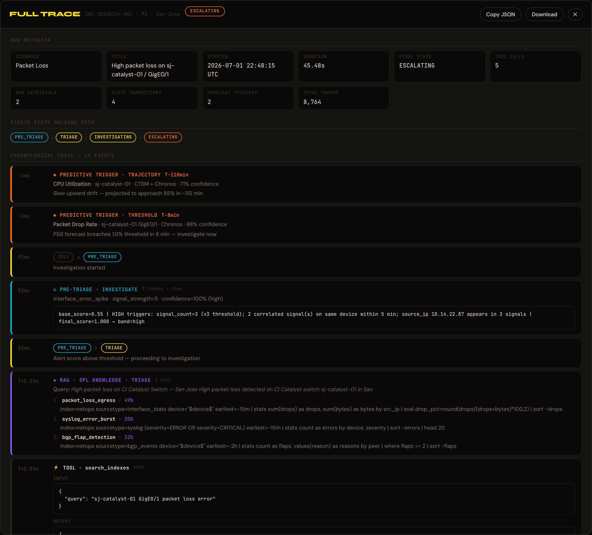

# Vigil Workflow — Visual Walkthrough

A section-by-section tour of the Vigil war-room dashboard, captured from the running local application. Each screenshot below shows a real UI region with real data — nothing is mocked in this walkthrough.

**How to read this doc:** each section covers one card or region of the UI, top-to-bottom in the order it renders on screen. For each region you get (a) the screenshot, (b) what it shows, and (c) what the underlying system is doing when it draws that view.

**Live demo:** [vigil-5vo3-14jb5xbig-nama7vijay-6218s-projects.vercel.app](https://vigil-5vo3-14jb5xbig-nama7vijay-6218s-projects.vercel.app) *(UI-only — for a full run with populated Tool Calls, Evidence, and Incident Report you'll need the local backend running; see [`../docs/deployment.md`](../docs/deployment.md#running-locally-full-stack).)*

---

## 0. Overview — Idle State


The full war-room dashboard before an investigation is triggered. Every card is in its "ready" state — forecast sparklines are drawn from pre-computed fixtures, the FSM sits at `IDLE`, and the Tool Calls / Evidence / Incident Report cards show empty-state placeholders. This is the view someone lands on when they first open Vigil.

**What's rendered here without a backend call:**
- Forecast Engine sparklines (fixture-backed — see [`ui/src/data/forecasts.ts`](../ui/src/data/forecasts.ts))
- FSM diagram in its resting layout
- Scenario tabs with pre-labeled outcomes (ESCALATING / REMEDIATING / SUPPRESSED)
- Run History (empty on first load, populated from `localStorage` on return visits)

---

## 1. Header — Scenario Selection + Action Bar


The header is the operator's control strip. Four elements matter:

| Element | Purpose |
|---|---|
| **`VIGIL` wordmark** | Product identity — Cavendish Yellow accent on obsidian black |
| **Scenario tabs** | Four canonical incidents — Packet Loss (ESCALATING), BGP Flap (REMEDIATING), CPU Spike (ESCALATING), False Positive (SUPPRESSED). Each tab has a severity pill (P1/P2/P3) and shows its expected FSM outcome. Clicking a tab loads that scenario's context; running an investigation shows whether Vigil reaches the labeled terminal state. |
| **Incident context** | Middle strip shows the incident ID (`INC-20240214-01`), severity (`P2`), site (`San Jose`), and a one-line title. Comes from `phase2_agent/scenarios/*.json`. |
| **Action buttons** | `Full Trace` opens the archived-run detail overlay. `Run Investigation` is the primary CTA — kicks off the FSM commander over SSE. |

The `READY` status pill on the far right cycles through `Investigating → Evaluating → Complete` (or `Error`) as a run progresses.

---

## 2. Forecast Engine — Proactive Trigger Layer


Vigil's Phase 4 pre-alert layer. Three time-series sparklines run continuously against Cisco Time Series Model (CTSM) + Chronos-T5-Small forecasts. Each panel shows historical values + a P10–P90 confidence band + the forecast median. The corner label declares which of four trigger types is firing:

| Trigger | When it fires | Example shown |
|---|---|---|
| **STABLE** | Forecast within confidence band, no threshold breach expected | BGP Route Count — flat trajectory, 846 → 848 routes projected |
| **TRAJECTORY** | Forecast diverges from baseline toward a breach horizon | CPU Utilization — 68% → 76% within T+110min |
| **THRESHOLD** | Forecast crosses a hard alerting threshold within the window | Packet Drop Rate — 0.55% → 2.84% (P50 breach 10% within T+8min) |
| **UNCERTAINTY** | Confidence band widens beyond a tolerance — the model itself is unsure | *(not visible in this scenario)* |

The two colored badges in the top-right (`1 CRITICAL TRIGGER` · `1 WARNING`) roll up the strip. This is what makes Vigil "proactive" instead of reactive — the FSM can start investigating *before* Splunk itself fires an alert.

---

## 3. FSM State Machine — Idle


The full 7-state finite-state machine. Reads left to right:

```
IDLE → PRE_TRIAGE → TRIAGE → INVESTIGATING → HYPOTHESIZING ─┬→ REMEDIATING → RESOLVED
                                                            ├→ ESCALATING → RESOLVED
                                                            └→ (SUPPRESSED — dead-end from PRE_TRIAGE)
```

Every transition is auditable — logged with the timestamp, reason, and the confidence score that drove the decision. This is the architectural core of Vigil: instead of a free-form agent that decides its own control flow, transitions between these seven states are the only way progress happens, and every arrow in the diagram is a Pydantic-validated event in the run log.

The dashed node (`SUPPRESSED`) branches off `PRE_TRIAGE` — Vigil's Phase 2.5 classifier can end a run before any Claude tokens are spent if the alert matches a known false-positive pattern.

---

## 4. FSM State Machine — Active Run


Same diagram, mid-investigation. Visited nodes darken to indicate the path taken; the current node lights up in red (or green, or amber depending on which branch fires). In this capture, the run has walked `IDLE → PRE_TRIAGE → TRIAGE → INVESTIGATING → HYPOTHESIZING → ESCALATING` — the packet-loss scenario, where the evidence points to a possible data-exfiltration egress and Vigil correctly decides *not* to self-heal but to hand off to a human.

`ESCALATING` here is not a failure state — it's the correct terminal for a novel or high-risk pattern. Vigil's decision rule: if confidence ≥ threshold *and* a known remediation exists, walk to `REMEDIATING`. Otherwise, `ESCALATING`. This is intentional — the point of a FSM is that "when in doubt, escalate" is a written-down transition, not an ad-hoc choice.

---

## 5. Tool Calls Feed — MCP Invocations + RAG Retrievals


Every action the agent takes streams into this feed in real time. Three types of events interleave:

**MCP tool calls** — grouped by badge:
- `SP` = Splunk MCP native tools (`run_spl_query`, `search_indexes`, `get_knowledge_objects`, `generate_spl`, `get_metadata`, `get_user_context`)
- `CI` = Cisco Catalyst tools (`get_network_topology`, `get_telemetry_metrics`)

Each row shows the tool name, elapsed time (`T+42ms`), duration (`156ms`), and a one-line result summary. Click any row for the full request/response payload.

**RAG events** (◈ badge) — Pinecone retrievals firing at specific FSM states:
- **`◈ TAG` at TRIAGE** — searches `vigil-spl-knowledge` for vetted SPL patterns matching the incident's tags (e.g. `bgp_flap_detection` for a BGP scenario)
- **`◈ MEMORY` at INVESTIGATING** — searches `vigil-incident-memory` for prior incidents with similar signatures (in the capture: `INC-2024-0895`, `INC-2024-0199`, `INC-2024-0311`)

**State transitions** — pill-shaped entries showing when the FSM moves (`TRIAGE → INVESTIGATING`, `INVESTIGATING → ESCALATING`). Each transition includes the trigger reason.

The `◈ N` counter in the card header is the total RAG hit count for the run — a metric that shows up in the Evaluator as a proxy for grounding quality.

---

## 6. Evidence Panel — What the Investigation Found


The findings — one bullet per structural observation extracted during investigation. These are the facts the FSM will feed into the Incident Report. In the packet-loss example: `sj-catalyst-01 GigE0/1: Host 10.14.22.87 drives 71.2% egress (threshold 60%) with 847 dest IPs and high port spread; 2847 out_errors + 1923 drops at 94.2% util suggest exfiltration or DDoS egress; requires security investigation.`

**Why this is separate from Incident Report:** Evidence is raw — it's the observations any two reasonable operators would agree on. The Incident Report on the right combines Evidence with a *hypothesis* and a *recommendation* — which is where operator judgment (or Claude reasoning) becomes visible and auditable.

The header counter (`1` in this shot) is the evidence-bullet count for the current run.

---

## 7. Incident Report — Structured Output


The final Pydantic-validated JSON output of an FSM run, formatted for reading. Six fields:

| Field | What it captures |
|---|---|
| **State badge** | Terminal FSM state (`ESCALATING` here, in orange) |
| **Summary** | One-sentence recap of what the FSM concluded |
| **HYPOTHESIS** | The proposed cause — a claim, not a fact |
| **RECOMMENDED ACTION** | What the FSM would do next (self-heal command or human escalation) |
| **CONFIDENCE** | The FSM's calibrated confidence in the hypothesis (78% in the capture) |
| **Metrics row** | `TOOL CALLS` · `DURATION` · `TOKENS` · `COST` — the four numbers the Evaluator scores on |

This is what gets persisted to the run log, archived to `Run History`, and (in production) posted to Slack / ServiceNow / a ticketing webhook. **Every field is a Pydantic-validated schema** — an FSM run cannot produce a report that fails schema validation; the run either produces a valid report or fails with an explicit `Error` state.

---

## 8. Phase 3 — Evaluator


Once an FSM run completes, the Evaluator scores it against *two* baseline model configurations and displays all three side by side:

- **INVESTIGATION** (blue) — the actual Vigil FSM run: 7-state commander, MCP tool calls, Pinecone RAG
- **GENERIC LLM** (orange) — the same base Claude model answering the same incident with no schema enforcement, no FSM, no RAG
- **CONSTRAINED** (green) — the same base Claude model with Pydantic schema enforcement + structured system prompt, no FSM, no RAG

Both baselines use the same LLM as Vigil. The point is to isolate what the *architecture* — FSM + tools + RAG + schema — contributes vs. raw model output.

The panel scores each column on four dimensions:

| Metric | What it measures |
|---|---|
| **Tokens** | Total tokens consumed for the run |
| **Cost** | `total_tokens × cost_per_1k` — dollar cost per investigation |
| **Precision** | Of the claims made, how many are supported by evidence? |
| **Recall** | Of the ground-truth findings, how many did the agent surface? |
| **Actionability** | Does the output name a specific device, threshold, and next step? |
| **Composite** | Weighted rollup — Vigil's headline quality metric |

**Real numbers from the capture:**
- **Investigation:** 8,764 tokens · $0.0427 · 100% precision · 89% recall · 75% actionability · **0.90 composite**
- **Generic LLM:** 1,993 tokens · $0.0183 · 56% precision · 56% recall · 50% actionability · **0.63 composite**
- **Constrained:** 1,435 tokens · $0.0102 · 100% precision · 89% recall · 100% actionability · **0.97 composite** · **-83.6% tokens vs. Investigation**

The Constrained column tells the interesting story: pure schema enforcement (no FSM, no tools, no RAG) can produce a Pydantic-valid answer that's structurally on-par with a full FSM run for this specific incident — at ~17% of the token cost. Vigil's headline value isn't the composite score; it's what the FSM *also* produces that the constrained-only run can't: an audit trail, a state-transition log, verified evidence from real tool calls, and a run history operators can review. Composite parity is the point where "cheaper baseline" becomes a real question worth answering, not a reason to skip the FSM.

This panel is what makes token cost a first-class concern in the product — you can see it dollar-cost every run, which matters at Splunk/Cisco scale.

---

## 9. Run History — Archived Runs


Persisted to `localStorage`, so every investigation the user has run in this browser accumulates here. Each row shows:

- The scenario ID (`Packet Loss` in the capture)
- Terminal state pill (`ESCALATING`)
- Duration and total tokens (`45.5s · 8,764 tokens`)
- Relative time (`45s ago`)

Clicking any row opens the **Full Trace Overlay** (next section) — the archived run's complete event log. The header `last 1 run · click to view full trace` is a hint to the user that these rows are interactive. `CLEAR` (top-right) wipes the entire history from `localStorage`.

Max retention: 10 runs. Once the archive hits that ceiling, the oldest is dropped as new runs archive — enough for the "review my last few investigations" use case without letting `localStorage` grow unbounded.

---

## 10. Full Trace Overlay — Auditable Event Log



Clicking a Run History row opens this overlay — Vigil's audit-trail view. Six sections, top to bottom:

**1. Run Metadata** — scenario, incident ID, severity, timestamp, duration, terminal state, tool-call count. The primary-key fields that identify this run in perpetuity.

**2. Metrics grid** — RAG retrievals, state transitions, forecast triggers fired, total tokens. Quick answers to "was this a heavy run?" or "did the forecast layer trigger?"

**3. FSM State Machine Path** — the exact sequence of states the FSM walked, as a pill trail: `PRE_TRIAGE → TRIAGE → INVESTIGATING → ESCALATING`. If any transition ever looks wrong in a post-incident review, this is where the auditor starts.

**4. Chronological Trace** — the full event stream, one row per event, ordered by elapsed time. Six event types interleave:
- **PREDICTIVE TRIGGER** — a forecast panel fired (Trajectory, Threshold, Uncertainty) with the model and confidence
- **FSM transition** — state change with the reason
- **PRE_TRIAGE classifier** — the alert-scoring layer's decision (signal_count, HIGH triggers, base/final score)
- **RAG** — a Pinecone retrieval with the query and top-K results
- **TOOL** — an MCP tool call with input payload (and, when expanded, output)

**5. Copy JSON / Download** buttons (top right) — the whole run serializes to JSON. Copy for pasting into Slack/ticket; Download for archival or offline replay. The exact JSON schema is documented under the "Trace Log JSON" section below.

**6. Close (✕)** — dismiss and return to the dashboard.

This is the "receipts" surface for anything Vigil has ever done in the current browser. Combined with backend-side run persistence (planned for the deployed backend), it forms the audit trail that regulators, security reviewers, and post-incident analysts expect.

---

## 11. Trace Log JSON — What Gets Persisted

A sample archived run — the actual output of the Download button — lives at [`sample-trace.json`](./sample-trace.json) in this folder. 13.3 KB, contains one full FSM investigation. Top-level shape:

```jsonc
{
  "id": "run-…",
  "scenarioMeta": { "id": "packet_loss", "label": "Packet Loss", "severity": "P2", ... },
  "startTimeMs": 1719872895000,
  "endTimeMs":   1719872938150,
  "durationMs":  43150,
  "finalState":  "ESCALATING",
  "fsmHistory":  ["PRE_TRIAGE", "TRIAGE", "INVESTIGATING", "ESCALATING"],
  "feedItems":   [ … 14 events: tool calls + RAG events + state transitions + pre-triage entries … ],
  "report": {
    "incident_id": "INC-20240214-001",
    "final_state": "ESCALATING",
    "hypothesis": "…",
    "evidence": [ … ],
    "tool_calls": 5,
    "recommended_action": "…",
    "confidence": 0.78,
    "total_tokens":  8698,
    "input_tokens":  …,
    "output_tokens": …,
    "cache_creation_input_tokens": …,
    "cache_read_input_tokens":     …,
    "haiku_input_tokens":  …,
    "haiku_output_tokens": …,
    "sonnet_input_tokens":  …,
    "sonnet_output_tokens": …,
    "duration_secs": …,
    "cost_usd":      0.0427,
    "cost_breakdown": { … }
  },
  "evalResults": {
    "incident_id": "INC-20240214-001",
    "investigation": { "precision": 1.0, "recall": 0.89, "actionability": 0.75, "composite": 0.90, "tokens": 8764, "cost_usd": 0.0427 },
    "generic":       { "precision": 0.56, "recall": 0.56, "actionability": 0.50, "composite": 0.63, "tokens": 1993, "cost_usd": 0.0183 },
    "constrained":   { "precision": 1.0, "recall": 0.89, "actionability": 1.0,  "composite": 0.97, "tokens": 1435, "cost_usd": 0.0102 },
    "token_savings_pct": -83.6
  },
  "mttdData":   { "headline": "…", "mttr_speedup_pct": 99.4, … },
  "totalTokens": 8764
}
```

**Why this is the audit surface, not the UI:**
- **`fsmHistory`** — the exact state path, immutable, verifiable against the FSM's declared transition rules
- **`feedItems`** — the complete event stream in insertion order, with elapsed timestamps; a full replay of what the operator saw
- **`report.cost_breakdown`** — every dollar of API spend attributed to a model tier (Haiku/Sonnet, cached vs. fresh)
- **`evalResults`** — the same run rescored against two baselines, so any claim about Vigil's precision/recall is checkable against the raw evidence

Any downstream system — ServiceNow, Slack, Splunk itself — can consume this JSON directly. For deployed backends, this is what would post to a webhook after every completed run.

---

## 12. Populated Overview — Everything Together


Every card, populated, at the end of a real completed run. This is the demo view — the frame that shows Vigil doing all of its work in one shot:

- Forecast Strip still active at top (proactive layer never sleeps)
- FSM has walked to `ESCALATING`
- Tool Calls feed shows 5 MCP invocations + 3 RAG memory hits + FSM state transitions
- Evidence and Incident Report both fully populated
- Evaluator's three-column comparison is complete
- Run History has 1 archived run available for Full Trace review

Status pill: `Complete` (green). Total wall-clock: 45.5 s. Total tokens: 8,764. Total cost: $0.0427. This is what "one incident, fully investigated, fully audited" looks like as a single artifact.

---

## Regenerating these screenshots

The screenshots are captured via headless Chromium against the local dev server. To reproduce:

```bash
# 1. Backend + UI running locally (see docs/deployment.md)
python -m api.server &
cd ui && npm run dev &

# 2. From project root, run the capture (Playwright + Chromium required)
node <path-to>/capture.mjs ./workflow/screenshots
```

The capture script and `sample-trace.json` regeneration script are not committed to the repo — they're scratchpad tools. If you want to add them as permanent utilities, move them to `scripts/capture-workflow-screenshots.mjs` and pin them in `package.json`.

Every run costs a small amount of Anthropic + Pinecone API budget (~$0.05–0.20 per full FSM run). Consider capturing idle-state screenshots only if you just need to refresh the layout.
